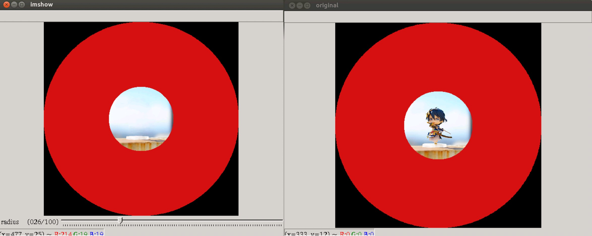
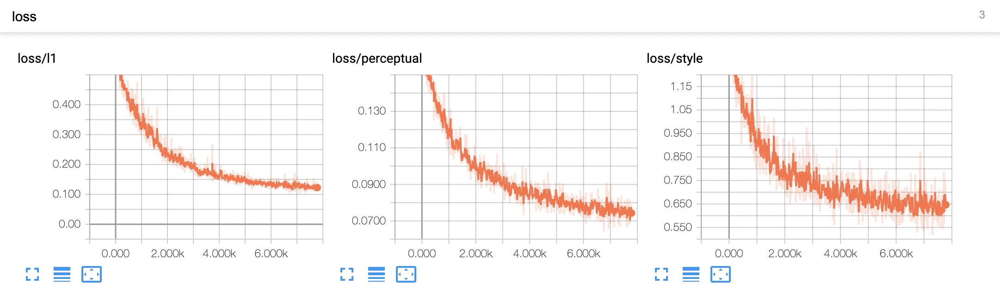
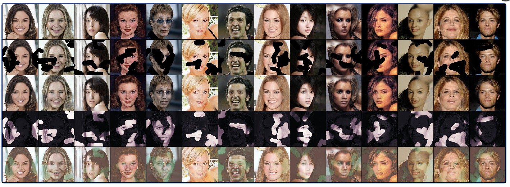

# Deep Fusion Network for Image completion

arxiv: http://xxx.itp.ac.cn/pdf/1904.08060v1  
the official code: https://github.com/hughplay/DFNet

Here we add training code to reproduce the author's results

## Prerequisites
- Python 3
- PyTorch 1.1+
- OpenCV
- TensorboardX
- apex


## preparation
- download your datasets (such as Celeba, Celeba-HQ, places365, paris)
- make flist for dataloader
```sh
$ cd core
$ python flist.py  # something params in the .py can be modified by yourself
```

## Training
训练涉及到的超参均在config/xx.yaml下  
如果想训练自己的数据集，可以视情况自行更改  

```python
# 以Celeba-HQ为例
python train_net ./config/celeahq.yaml
```


### Testing 
基于opencv写了一个简单的实时界面交互来进行修复测试  
鼠标左键用于涂抹，radius控制线条的粗细
```python
python ui.py <ckpt_path> <img_path>
```
<p align="center">
  
</p>


## Tensorboard
loss和中间结果可视化
<p align="center">
  
</p>

<p align="center">
  
</p>

## 讨论
模型结构未改动，loss也是参照作者提供的，实验过程中发现tv loss是递增的，尝试剔除它，结果影响不大